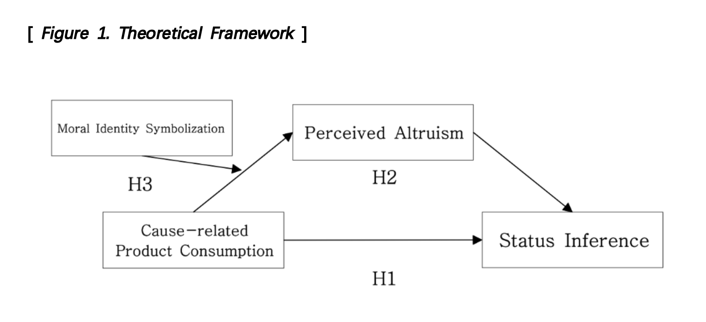

# Cause-related Product Consumption & Social Status Inference  
_A Data Science Project by Boa Kim_

---

## Overview
This project investigates whether **cause-related product consumption** (e.g., eco-friendly or CSR-linked brands) functions as a **status signal**, similar to luxury goods.  

- Hypothesis: Cause-related products → higher **status inference** through **perceived altruism**  
- Moderator: **Moral identity symbolization** strengthens this effect  
- Data collected via **Qualtrics online survey experiments** (N = 227, UK participants via Prolific)  

---

## Method
- **Design:** Two between-subject experiments (N=81, N=146)  
- **Platform:** Qualtrics (survey-based experimental design)  
- **Analysis Tools:**  
  - Mediation & Moderation (Hayes PROCESS macro, bootstrapping)  
  - t-tests, ANOVA, regression  
- **Measures:** Perceived altruism, status inference, moral identity symbolism  

---

## Key Findings
- ✅ Cause-related products → **significantly higher status inference** (*p* = .028)  
- ✅ **Perceived altruism mediates** the effect (indirect effect = .196, 95% CI [.083, .336])  
- ✅ **Moral identity symbolism moderates** altruism perception (*p* = .049)  
- ❌ Direct effect (without altruism) was not significant  

---

## Business Impact
- Cause-related products can act as **status symbols**, not just ethical choices.  
- CSR-linked branding serves as a **prestige signal** to consumers.  
- Applications: **Marketing strategy, UX research, healthcare surveys, consulting insights**.  

---

## Skills Highlighted
- Experimental Design & Hypothesis Testing  
- Survey-based Data Collection (Qualtrics)  
- Mediation & Moderation Analysis (Causal Inference)  
- Statistical Programming (SPSS → transferable to Python/R)  
- Data Visualization & Reporting  

---

## Framework


---

## Repository Structure
```
├── README.md
├── thesis.pdf
├── figures/
│ └── theoretical_framework.png
└── results/
└── key_statistics.csv(will be updated soon)
```

